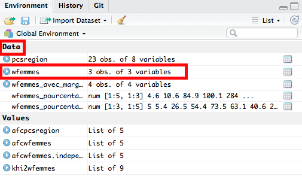

```{r setup, include=FALSE}
knitr::opts_chunk$set(echo = TRUE)
```

```{r knitr_init, echo=FALSE, results="asis", cache=FALSE}
library(knitr)
```

```{r tufte, include=FALSE}
library(tufte)
```

# Auteurs
[**Jean-Baptiste PRESSAC**](Jean-Baptiste.Pressac@univ-brest.fr "Mail de Jean-Baptiste PRESSAC") ([CRBC](https://www.univ-brest.fr/crbc/menu/Membres+du+laboratoire/Personnel_administratif_et_technique/Jean-Baptiste_Pressac "Laboratoire CRBC"), CNRS)     
[**Laurent MELL**](laurent.mell@univ-brest.fr "Mail de Laurent MELL") ([LABERS](https://www.univ-brest.fr/labers/ "Laboratoire LABERS"), UBO)       

Si vous avez des commentaires à formuler ou des remarques à effectuer, vous pouvez nous contacter par mail (par le biais de nos noms ci-dessus). Par la même occasion, si vous souhaitez échanger plus en détail et/ou contribuer à cette démarche, nous sommes aussi disponibles.


# Introduction

Ce premier travail s'inscrit dans une démarche de réflexion, plus large, que nous souhaitons entreprendre autour **l'analyse de données multidimensionnelles**. La spécificité de l'exercice réside dans le fait que nous allons nous concentrer sur **l'analyse factorielle des correspondances (AFC)**. Notre objectif sera d'étudier les **éventuelles** liaisons entre les modalités de deux variables qualitatives. Par ailleurs, nous avons fait le choix d'utiliser le logiciel [R](https://www.r-project.org/ "Logiciel R") ainsi que l'environnement de développement [RStudio](https://www.rstudio.com/ "Environnement de développement RStudio").


# Les données

Les données sur lesquelles nous allons travailler proviennent, en partie, du MOOC [Analyse des données multidimensionnelles](https://www.fun-mooc.fr/courses/agrocampusouest/40001S03/session03/about "MOOC Analyse de données multidimensionnelles") sur la plateforme [FUN](https://www.fun-mooc.fr/ "Plateforme FUN"). Ce MOOC est proposé par [François Husson](http://math.agrocampus-ouest.fr/infoglueDeliverLive/membres/Francois.Husson "François Husson"), [Jérôme Pagès](http://math.agrocampus-ouest.fr/infoglueDeliverLive/membres/Jerome.Pages "Jérôme Pagès") et [Magalie Houée-Bigot](http://math.agrocampus-ouest.fr/infoglueDeliverLive/membres/Magalie.Hou%C3%A9e-Bigot "Magalie Houée-Bigot").

Les données sont issues d'un enquête du [CREDOC](http://www.credoc.fr/) publiée en 1974 par Nicole Tabard, intitulée "Besoins et aspirations des familles et des jeunes"^[Tabard N. (1974), _Besoins et aspirations des familles et des jeunes_, Caisse nationale des Allocations Familiales, Paris.]. Le MOOC ne nous donne pas d'informations sur les circonstances dans lesquelles le questionnaire a été établi ni sur le nombre total de questions. Nous savons uniquement qu'il a porté sur 1724 femmes. L'AFC ne nous permettra pas d'analyser l'intégralité du questionnaire. De toute façon, nous allons nous focaliser sur une relation spécifique. Nous allons étudier l'articulation des réponses qualitatives à deux questions :       

* Quelle est la famille idéale pour vous ?
* Quelle activité convient le mieux à une mère de famille quand ses enfants vont à l’école ?       

Le point de départ de l'analyse est le tableau de contingence reproduit ci-dessous. C'est ce type de données (les marges des totaux mis à part) que nous fournirons à la fonction de calcul de l'AFC.       


Comme le souligne François Husson dans le MOOC, il est difficile de savoir à partir de ce tableau si les femmes sont favorables ou non au travail féminin. En effet, 908 femmes sur 1 724, soit 52 % ont répondu que la famille idéale est celle où "seul le mari travaille". Elles sont néanmoins 1 123 sur 1 724 (65 %) à avoir répondu que l'activité convenant le mieux à une mère de famille quand ses enfants vont à l’école est de travailler à mi-temps. L'AFC va nous permettre d'étudier le lien entre ces deux questions et de lever cette apparente contradiction. Elle va notamment nous permettre de visualiser la nature de la liaison entre les deux questions. Mais qu'est ce qu'une liaison ?       

Une liaison entre deux variables est l'écart entre les données observées et le modèle d'indépendance. Mettons pour l'instant de côté cette notion, nous y reviendrons plus tard.

# Création du projet RStudio

Commençons par ouvrir le logiciel RStudio et par créer un nouveau projet depuis le menu File > New Project. Choisissons ensuite "New directory" > "Empty project" puis saisissons *AFC-sous-R* dans Directory name. Téléchargeons le fichier [AnaDo_JeuDonnees_TravailFemme.csv](https://raw.githubusercontent.com/JBPressac/AFC-sous-R/master/AnaDo_JeuDonnees_TravailFemme.csv) du tableau de contingence et plaçons-le dans le répertoire "AFC-sous-R". Créons ensuite notre script R depuis File > New file > R script.        


# Définir la localisation du répertoire de travail

Il est très important, d'emblée, de définir le répertoire de travail. Il existe une commande `getwd()` qui permet d'afficher la localisation du répertoire de travail sous la forme d'un chemin absolu :       

```{r getwd()}
getwd()
```

La définition du répertoire de travail peut aussi être faite par le biais de la commande `Set As Working Directory` via l'onglet `More`. Cet onglet correspond au symbole de la roue crantée dans la fenêtre en bas à droite de RStudio.


# Importation du jeu de données

Nous lisons ensuite le fichier CSV à partir de la fonction `read.table()` :

```{r read.table}
wfemmes <- read.table("AnaDo_JeuDonnees_TravailFemme.csv", header=TRUE, 
                  row.names=1, sep=";", check.names=FALSE, fileEncoding="latin1")
```

* La fonction `read.table()` permet de lire un fichier dans un format tabulaire et de créer une dataframe à partir de ce dernier.         
* L'argument `header=TRUE`permet de spécifier que la première ligne du jeu de données correspond aux intitulés des colonnes.       
* L'argument`row.names=1`permet de spécifier que le nom des lignes est contenu dans la première colonne.       
* L'argument `sep=";"`indique que le séparateur de colonne est le point-virgule.       
* L'argument `check.names=FALSE` permet d'empêcher R de modifier la syntaxe du nom des modalités de variable.
* L'argument `fileEncoding="latin1"` permet de spécifier l'encodage du fichier.     

Afin de faciliter, par la suite, la lecture et l'emploi du jeu de données, nous **stockons le résultat dans la variable** `wfemmes`.

Nous pouvons, très facilement et à n'importe quel moment, afficher le tableau de contingence `wfemmes` à partir du volet Data dans la fenêtre en haut à droite de RStudio.

       
       
Seules les trois premières colonnes du jeu de données sont utilisées ici. Nous avons donc besoin de suppprimer les colonnes dont nous n'aurons pas l'utilité. Plus spécifiquement, nous n'allons **sélectionner que les trois premières colonnes** avec la commande suivante :

```{r wfemmes[1:3]}
wfemmes <- wfemmes[1:3]
```     

Dans cette commande :       

* En spécifiant `[1:3]` (entre crochets), nous indiquons que nous ne sélectionnons que les 3 premières colonnes.       

Nous pouvons voir que, dans le volet Data dans la fenêtre en haut à droite de RStudio, le nombre de variables affichées a été réduit.

        
        
Afin d'amliorer la lecture du tableau et, par la suite, du graphique, nous allons renommer les modalités des deux variables grâce à la fonction `dimnames()` :

```{r (dimnames(wfemmes)}
dimnames(wfemmes)[[1]][1]<-"Les 2 conjoints travaillent"
dimnames(wfemmes)[[1]][2]<-"Travail du mari plus absorbant"
dimnames(wfemmes)[[1]][3]<-"Seul le mari travaille"
dimnames(wfemmes)[[2]][1]<-"Rester au foyer"
dimnames(wfemmes)[[2]][2]<-"Travail à mi-temps"
dimnames(wfemmes)[[2]][3]<-"Travail à plein-temps"
```

Pour la fonction `dimnames()` :       

* `[[1]]` (entre deux doubles crochets) permet de spécifier que nous allons renommer une ou plusieurs modalités en ligne.
* `[[2]]` (entre deux doubles crochets) permet de spécifier que nous allons renommer une ou plusieurs modalités en colonne.
* `[1]` (entre crochets) permet de spécifier que nous allons renommer la première modalité d'une variable.
* `[2]` (enter crochets) permet de spécifier que nous allons renommer la deuxième modalité d'une variable.       

Suivant cette logique, lorsque nous écrivons, par exemple, `(dimnames(wfemmes)[[2]][3]<-"...")`, cela signifie que nous allons renommer la troisième modalité en colonne.

Notez que nous pouvons calculer sous R les marges lignes et les marges colonnes du tableau de contingence de la manière suivante :


```{r wfemmes_avec_marges}
wfemmes_avec_marges <- wfemmes
wfemmes_avec_marges$Total <- rowSums(wfemmes_avec_marges)
wfemmes_avec_marges[nrow(wfemmes_avec_marges)+1, ] <- colSums(wfemmes_avec_marges)
row.names(wfemmes_avec_marges)[nrow(wfemmes_avec_marges)] <- "Total"
wfemmes_avec_marges
```


Affichons ce tableau de manière plus agréable :

```{r, echo=FALSE}

kable(wfemmes_avec_marges) 
```

Il est aussi intéressant de calculer les pourcentages en ligne et les pourcentages en colonne avec la librairie `Rcmdr`.


```{r Rcmdr}
library (Rcmdr)
```

```{r kable(wfemmes_pourcentage_en_ligne)}
wfemmes_pourcentage_en_ligne <- wfemmes
wfemmes_pourcentage_en_ligne[nrow(wfemmes_pourcentage_en_ligne)+1, ] <- colSums(wfemmes_pourcentage_en_ligne)
row.names(wfemmes_pourcentage_en_ligne)[nrow(wfemmes_pourcentage_en_ligne)] <- "Profil ligne moyen"
wfemmes_pourcentage_en_ligne <- rowPercents(wfemmes_pourcentage_en_ligne)
```

```{r, echo=FALSE}
kable(wfemmes_pourcentage_en_ligne, caption="Tableau des pourcentages en ligne")
```

Pour rappel, la ligne "Profil ligne moyen" correspond à la répartition en pourcentage des modalités à la question sur "l'activité qui convient le mieux à une mère de famille quand les enfants vont à l'école", quelque soit la réponse à la question sur la famille idéale. Le profil ligne moyen peut être comparé aux profils lignes (la répartition en pourcentages ou la distribution de probabilité d'une modalité en ligne). Ici, aucun des trois profils lignes n'est proche du profil ligne moyen.

Calculons maintenant le tableau des pourcentages en colonne.


```{r wfemmes_pourcentage_en_colonne}
wfemmes_pourcentage_en_colonne <- wfemmes
wfemmes_pourcentage_en_colonne$Total <- rowSums(wfemmes_pourcentage_en_colonne)
wfemmes_pourcentage_en_colonne <- colPercents(wfemmes_pourcentage_en_colonne)
dimnames(wfemmes_pourcentage_en_colonne)[[2]][4] <- "Profil colonne moyen"
```
```{r, echo=FALSE}
kable(wfemmes_pourcentage_en_colonne, caption="Tableau des pourcentages en colonne")
```

Ce tableau permet de constater que la répartition des réponses sur la famille idéale pour la modalité "Travail à mi-temps" est le plus proche de la répartion des réponses à la question sur la famille idéale. Autrement dit, le profil colonne "Travail à mi-temps" est le profil colonne le plus proche du profil colonne moyen. Cette similitude se traduira sur le graphe de l'AFC comme nous le verrons plus loin.

Nous verrons également que l'on passera en paramètre à la fonction R de calcul de l'AFC, le tableau de contingence. Mais l'AFC travaille en réalité sur le tableau de probabilités que l'on peut calculer en divisant les valeurs du tableau de contingence par le nombre d'individus (on effectue le calcul sur le tableau de contingence avec marge pour mieux constater que l'effectif total du tableau de probabilité est bien égal à 1, ce qui est la marque d'une distribution de probabilités) :

```{r}
wfemmes_tableau_de_probabilite <- wfemmes_avec_marges / 1724
```
```{r, echo=FALSE}
kable(wfemmes_tableau_de_probabilite, caption="Tableau de probabilités")
```


Rappellons que notre objectif est de **visualiser la nature de la liaison entre deux variables qualitatives**. Mais faut-il encore que cette liaison soit **significative**.        

Pour ce faire, nous réalisons un **test du Khi2**.      


# Test du Khi2

Le test du khi2 mesure la **significativité d'une liaison mais pas son intensité**. Afin de réaliser ce test du khi2, nous utilisons une fonction fournie de base avec le logiciel R. Il s'agit de la fonction `chisq.test`. Il n'est pas nécessaire d'installer une librairie supplémentaire afin de réaliser ce test.       

```{r chisq.test(wfemmes)}
chisq.test(wfemmes)
```

Le terme `X-squared` est à lire `Khi2` soit Khi au carré. La fonction `chisq.test` nous donne, entre autres, la valeur du Khi2 qui est un **indicateur de la significativité de la liaison**. Mais ce qui nous interesse ici est la `p-value`. Nous voyons ici que la `p-value` est inférieure à 2,2x10^-16^. Cela signifie que la **probabilité que les variables soient indépendantes** est inférieure à 2,2x10^-16^. Ce qui nous permet de rejeter l'hypothèse d'indépendance entre les deux variables. Pour autant, cela ne veut pas dire que les variables soient dépendantes. Les réponses à la question sur la famille idéale sont probablement liées aux réponses concernant l'activité convenant le mieux à une mère de famille dont les enfants vont à l'école.          


## Test du Khi2 - Explications

Le test du khi2 permet de **déterminer la probabilité que les deux variables d'un tableau de contingence soient indépendantes**, c'est-à-dire qu'il n'existe pas de relation entre les modalités en ligne et les modalités en colonne (les unes ne conditionnent pas les autres, et réciproquement). Dit autrement et comme le [rappelle très clairement Julien Barnier](https://alea.fr.eu.org/pages/khi2 "Test du khi2 par Julien Barnier"), cela veut dire que le "fait d'appartenir à une modalité de la première variable n'a pas d'influence sur la modalité d'appartenance de la deuxième variable". Dans ce test, l'hypothèse nulle (H0) suppose qu'il y a indépendance entre les deux variables. Si nous acceptons l'hypothèse d'indépendance (H0), nous n'aurons pas d'utilité à réaliser une AFC car les points projetés seront extrêmement proches ou confondus avec le centre de gravité, confondus avec le centre du graphe. Si nous rejetons l'hypothèse d'indépendance (p-value < 0,05), l'hypothèse alternative (H1) suppose que la liaison entre les deux variables est significative sans que nous puissions définir l'intensité de la liaison.       

Rappelons que pour que le test du khi2 soit opératoire, il doit respecter un certain nombre de [conditions](http://grasland.script.univ-paris-diderot.fr/STAT98/stat98_8/stat98_8.htm) (pour reprendre les propos de Claude Grasland) :       

* L'**effectif total** du tableau de contingence doit être supérieur ou égal à 20.
* L'**effectif marginal** du tableau de contingence doit toujours être supérieur ou égal à 5.
* L'**effectif théorique** des cases du tableau de contingence doit être supérieur à 5 dans 80% des cases du tableau de contingence.

Du fait que nous ayons obtenu une p-value inférieure à 2,2x10^-16^ et, par extension, inférieure au seuil de 0,05, nous **rejetons l'hypothèse d'indépendance entre les deux variables**.

Comme le résultat est significatif, tout en respectant les conditons de validité du test du khi2, nous stockons le résultat de la fonction dans la variable `khi2wfemmes`.

```{r khi2wfemmes}
chisq.test(wfemmes) -> khi2wfemmes
```     


## Test du Khi2 - Aide à l'interprétation

Le test du khi2 est symétrique. Les lignes et les colonnes du tableau croisé sont interchangeables. Le résultat du test sera exactement le même. Il n'y a pas de "sens de lecture" du tableau.

Nous pouvons afficher le tableau de contingence d'origine (**tableau des données observées**) en sélectionnant la valeur `observed`.

```{r khi2wfemmes$observed}
khi2wfemmes$observed
```

De la même manière, nous pouvons afficher le tableau d'indépendance (**tableau des effectifs théoriques**) en sélectionnant la valeur `expected`. Dans ce contexte, nous calculons le tableau des pourcentages théoriques, en multipliant pour chaque case la proportion observée dans la population des deux modalités correspondantes. Puis, le tableau des effectifs théoriques se calcule en multipliant le tableau des pourcentages théoriques par l'effectif total.

Pour plus de détails, nous vous recommandons la lecture de ce document de Julien Barnier : [Tout ce que vous n'avez jamais voulu savoir sur le Khi2 sans jamais avoir eu envie de le demander](https://alea.fr.eu.org/pages/khi2 "Test du khi2 par Julien Barnier").

```{r khi2wfemmes$expected}
khi2wfemmes$expected
```

Le tableau des effectifs théoriques n'a que peu d'intérêt en lui-même mais en a davantage comparativement au tableau des données observées.

Nous pouvons aussi afficher le tableau des résidus (**tableau des écarts à l'indépendance**) en sélectionnant la valeur `residuals`. Un résidu positif signifie que les effectifs dans la case sont supérieur à ceux attendus sous l'hypothèse d'indépendance. Et l'inverse pour un résidu négatif.

```{r Khi2wfemmes$residuals}
khi2wfemmes$residuals
```     

Exprimé d'une autre manière, l'écart à l'indépendance représente l'**écart entre l’effectif observé et l’effectif théorique**, et ceci pour chacune des cases du tableau de contingence. D'ailleurs, comme le note [Philippe Cibois](https://www.scienceshumaines.com/textesInedits/Cibois.pdf "Précisions sur l'écart à l'indépendance p.16-38"), l'écart à l'indépendance "est un effectif et c'est un invariant, indépendant du choix des lignes et des colonnes (c'est la différence entre l'effectif observé et l'effectif théorique : le résultat est donc un effectif)."

Par ailleurs,

* Un **écart à l'indépendance positif** correspond à une **attraction** entre les deux modalités pour la case observée.
* À l'inverse, un **écart à l'indépendance négatif** correspond à une **opposition** entre les deux modalités pour la case observée.        

Plus la valeur de l'écart à l'indépendance est importante, plus l'attraction/opposition entre les modalités est forte.


# Rappel de l'objectif

Notre objectif est bien de **visualiser la nature de la liaison entre les deux variables qualitatives**. Sachant qu'une liaison correspond à **l'écart entre les données observées et le modèle d'indépendance**, nous souhaitons donc **visualiser la nature de l'écart à l'indépendance entre deux variables qualitatives**.

Par ailleurs, il y a **trois façons de caractériser la liaison** entre les deux variables qualitatives.

* La **significativité** de la liaison (qui se mesure avec le test du khi2).
* L'**intensité** de la liaison (qui se mesure, entre autre, avec le Phi2).
* La **nature** de la liaison (qui correspond à l'association entre les modalités et qui est représentée par le biais de l'AFC).

# Chargement des packages

Le test du Khi2 a permis d'écarter l'hypothèse d'indépendance. Il y a donc une liaison entre les modalités des deux variables. De fait, nous pouvons faire une AFC pour visualiser la nature de la liaison. Pour notre part, nous avons choisi d'utiliser le **package** [**FactoMineR**](https://cran.r-project.org/web/packages/FactoMineR/index.html "Page du package FactoMineR") (dédié à l'analyse multidimensionnelle de données) mais il y en existe d'autres qui peuvent être utilisés pour réaliser ce type de méthode statistique.       

Nous chargeons donc la librairie `FactoMineR` permettant de réaliser plusieurs analyses de données multi-dimentionnelles (AFC, ACP, ACM, etc.).

```{r library (FactoMineR)}
library (FactoMineR)
```     


# AFC - Les résultats

Lors du précédent test du khi2, nous avons obtenu une p-value inférieure à 2,2x10^-16^. Nous avons donc rejeté l’hypothèse d’indépendance entre les deux variables et admis que la liaison entre ces deux variables est signficative.       

Nous sommes en droit de réaliser une AFC afin de visualiser la nature de la liaison. Pour ce faire, nous allons employer la fonction `CA()`, fournie par le package `FactoMineR` que nous venons de charger. Précédemment, nous avons stocké notre jeu de données dans la variable `wfemmes`. Nous exécutons une analyse factorielle des correspondances (AFC) sur notre jeu de données de la manière qui suit :

```{r CA(wfemmes)}
afcwfemmes <- CA(wfemmes)
```

Afin de faciliter, par la suite, la lecture et l'emploi des résultats cette AFC, nous les **stockons dans la variable** `afcwfemmes`.

Revenons un instant sur ce fameux **tableau 37**, issu de l'enquête de Nicole Tabard, croisant les deux variables (questions) :       

* Quelle est la famille idéale pour vous ?
* Quelle activité convient le mieux à une mère de famille quand ses enfants vont à l’école ?       

Il est important de rappeler que les résultats de cette enquête ont été publiés en 1974. Il est fort à parier que la répartition des réponses serait totalement, si ce n'est en grande partie, différente aujourd'hui.


Lors d'une première lecture de ce tableau de contingence, François Husson soulève une **apparente contradiction**. À la question "Quelle est la famille idéale pour vous ?", nous voyons que 908 femmes sur 1 724 (visible dans la **marge colonne**), soit environ 53 % des répondantes, déclarent "Seul le mari travaille" et seulement 261 femmes sur 1 724 (environ 15 %) déclarent "Les deux conjoints travaillent également". Sur la base de ces premières réponses, nous pouvons émettre l'hypothèse, qu'à cette époque, une majorité était en faveur d'un modèle familial où seul le mari travaille.       

À côté de ça, à la question "Quelle activité convient le mieux à une mère de famille quand ses enfants vont à l’école ?", elles sont 1 440 sur 1 724 (visible dans la **marge ligne**), soit environ 84 %, à être en faveur du travail à mi-temps ou à plein-temps. Les réponses à cette question semblent indiquer que les femmes sont moins hostiles au travail féminin (bien au contraire).       

Du coup, à ce stade de l'interprétation, nous nous retrouvons _a priori_ face une **contradiction**.       

De cela, nous pouvons dire que le tableau de contingence ne permet pas de savoir si les femmes des années 70 sont favorables ou non à l'activité féminine. Par contre, Une **première lecture du graphe de l'AFC** nous permet de dire que les modalités des réponses s'associent entre elles des plus favorables au travail féminin aux plus défavorables au travail féminin.       

Avant d'approfondir, plus en détail, l'interprétation de cette AFC, nous allons faire un pas de côté et voir ce qui se passe dans le cas où il y aurait **indépendance entre les deux variables**.       

Si nous réalisons une AFC avec les données du modèle d'indépendance :       

```{r CA(khi2wfemmes$expected)}
afcwfemmes.independance <- CA(khi2wfemmes$expected)
```

La lecture de ce graphique nous permet de voir que les points sont quasiment tous **confondus avec le centre de gravité**, correspondant au **profil moyen**. La représentation graphique est trompeuse mais l'échelle des axes va dans le sens de notre interprétation. Simplement, ce qu'il y a retenir de ce graphe, c'est que, lorsqu'il y a indépendance entre les deux variables, tous les points sont confondus avec l'origine. Du fait qu'il n'y ait pas d'écarts à l'indépendance, il n'y a graphiquement rien à exploiter, rien à interpréter, rien à analyser. Ce graphe donne à voir ce que nous avons précédemment énoncé, à savoir que :

* Si nous acceptons l'hypothèse d'indépendance (p-value > 0,05 dans le cas d'un test du khi2), nous n'aurons pas d'utilité à réaliser une AFC car les points projetés seront extrêmement proches ou confondus avec le centre de gravité, confondus avec le centre du graphe.
* La réalisation d'un test du khi2 est donc fortement conseillée avant la réalisation d'une AFC.
* Plus précisément, le test du khi2 conditionne l'éventuelle réalisation d'une AFC.       

Les résultats qui suivent vont aussi dans le sens de notre propos :       

```{r summary(afcwfemmes.independance)}
summary(afcwfemmes.independance)
```

Dans le cas où il y a indépendance entre les deux variables, le **test du khi2 nous donne une p-value = 1**. Les coordonnées (dim.n) des modalités en ligne et en colonne, sur chacune des dimensions, sont égales à 0. Il en va de même pour leur contribution à la construction (ctr) de chaque dimension et leur qualité de réprésentation (cos2) sur chaque dimension.       

Quittons ce cas d'indépendance et revenons maintenant à notre premier jeu de données où la liaison entre les variables est significative.       

Les différentes fonctions proposées par le logiciel R, ainsi que celles associées aux multiples packages disponibles, nous permettent l'affichage du graphe.       

```{r plot(afcwfemmes)}
plot(afcwfemmes, cex = 0.7, cex.axis = 0.6, cex.lab = 0.8, title = "Représentation graphique", 
     selectRow = "cos2 0.7", selectCol = "cos2 0.7")
```     

Voici le détail des arguments que nous avons utilisés avec la fonction `plot()` :       

* L'argument `cex=` permet de modifier la taille des points et des textes accompagnant ces points.       
* L'argument `cex.axis` permet de modifier la taille des annotations d'axe.       
* L'argument `cex.lab` permet de modifier la taille des intitulés d'axe.       
* L'argument `title=` permet de donner un titre au graphique.       
* L'argument `selectRow=` permet de sélectionner les modalités en ligne à afficher en fonction de critères particuliers.       
* L'argument `selectCol=` permet de sélectionner les modalités en colonne à afficher en fonction de critères particulier.       

Ce ne sont que quelques arguments, parmi d'autres, en vue d'améliorer la représentation graphique. Dans le jeu de données qui nous concerne, ces améliorations restent mineures et n'ont que peu d'impact sur la représentation graphique. Par contre, dans le cas où nous aurions à travailler sur un tableau de contingence, dont chacune des variables comporte au moins une vingtaine de modalités, ces améliorations graphiques prendraient d'autant plus d'importance.       

Appuyons-nous sur un exemple pour illustrer notre propos. Nous allons utiliser des données de l'INSEE sur les [spécificités socioprofessionnelles régionales](https://www.insee.fr/fr/statistiques/1281090#consulter "Spécificités socioprofessionnelles régionales").       

Importons donc le jeu de données.       

```{r read.table(pcsregion)}
pcsregion <- read.table("pcsregion.csv", header=TRUE, row.names=1, 
                        sep=";", check.names=FALSE, fileEncoding="latin1")
```

Lisons le jeu de données.       

```{r view(pcsregion)}
View(pcsregion)
```

Lorsque nous réalisons une AFC avec ce jeu de données, nous obtenons ceci :       

```{r CA(pcsregion)}
afcpcsregion <- CA(pcsregion)
```

Soyons honnêtes. Avec "seulement" 30 modalités (8 modalités en colonne et 23 modalités en ligne),  nous voyons que **le graphe est (en grossissant légèrement le trait) "totalement" illisible**. C'est dans ce contexte que l'utilisation des différents arguments, que nous avons détaillés plus haut autour de la fonction `plot()`, prennent leur véritable importance.      

```{r plot(afcpcsregion)}
plot(afcpcsregion, cex = 0.6, cex.axis = 0.6, cex.lab = 0.8, 
     title = "Spécificités socioprofessionnelles régionales", 
     selectRow = "cos2 0.7", selectCol = "cos2 0.7")
```  

De cette manière, nous pouvons, par exemple, jouer sur la taille des noms de modalité et ne sélectionner que celles qui ont une qualité de représentation significative (arbitrairement cos2 > 0,7). Alors, bien évidemment, il ne s'agit que d'un exemple pour souligner l'éventail des possibilités mis à notre disposition en vue d'améliorer la représentation graphique, ainsi que la lecture et l'analyse des données.

Revenons maintenant à nos données initiales quant aux représentations sur le travail féminin.       

# Le nombre d'axes à interpréter       

Au-delà de la simple lecture visuelle du graphe, il existe d'autres moyens d'interpréter nos données. À partir de là, il serait intéressant de déterminer le nombre d'axes à interpréter.       

Les valeurs propres (i.e. variance) des axes :       

```{r Valeur propre des axes(afcwfemmes)}
afcwfemmes$eig
```

Dans le résultat de `afcwfemmes$eig`, les axes (aussi appelés *facteurs*) sont appelés `dim`. La *valeur propre* ou `eigenvalue` représente la quantité d'information expliquée par l'axe. La deuxième colonne renvoie au *pourcentage d'inertie*, correspondant à la proportion des variations totales des variables originales expliquées par chaque axe.

Nous pouvons, à la suite, effectuer une représentation de l'histogramme des valeurs propres :     

```{r barplot(afcwfemmes)}
barplot(afcwfemmes$eig[,1], main = "Histogramme des valeurs propres", 
        sub = "Représentations des femmes sur le travail féminin", 
        xlab = "Axes", ylab = "Pourcentage d'inertie", cex.axis = 0.8, 
        cex.names = 0.8, col ="orange", names.arg = 1:nrow(afcwfemmes$eig))
```

Détails des arguments utilisés dans la fonction `barplot()` :       

* L'argument `main=` correspond au titre du graphique.
* L'argument `sub=` correspond au sous-titre du graphique.
* L'argument `xlab=` correspond au titre de l'axe x.
* L'argument `ylab=` correspond au titre de l'axe y.
* L'argument `cex.axis=` permet de modifier la taille des valeurs numériques du graphique.
* L'argument `cex.names=` permet de modifier la taille des valeurs lettrées du graphique.
* L'argument `col=` permet de modifier la couleur des barres.
* L'argument `names.arg=` permet de nommer chaque barre.       

L'histogramme va servir visuellement à déterminer le nombre d'axes à interpréter à l'aide du critère du "coude" de Cattell. Lorsqu'on observe un décrochement entre deux axes, on détermine les axes avant ce décrochement comme étant les axes à interpréter. Ce n'est pas la seule règle possible. Un autre critère de choix, appelé « critère de Kaiser », suggère de garder tous les axes dont la valeur propre est supérieure à la valeur propre moyenne (qui vaut par définition 1 divisé par le nombre d'axes). Pour plus d'informations, nous vous invitons à vous reporter au lien suivant afin d'approfondir ce travail quant au [nombre d'axes à retenir](http://quanti.hypotheses.org/930/ "Histogramme des valeurs propres").       

Ce jeu de données ne permet pas de réellement saisir cette démarche qui vise à déterminer le nombre d'axes à interpréter. Pour ce faire, reprenons nos données sur les spécificités socioprofessionnelles régionales.

Voici les valeurs propres des axes :       

```{r Valeur propre des axes(afcpcsregion)}
afcpcsregion$eig
```

Dans ce nouvel exemple, nous abtenons sept facteurs (ou axes). Présentons, dans la foulée, l'histogramme des valeurs propres :     

```{r barplot(afcpcsregion)}
barplot(afcpcsregion$eig[,1], main = "Histogramme des valeurs propres", 
        sub = "Spécificités socioprofessionnelles régionales", 
        xlab = "Axes", ylab = "Pourcentage d'inertie", cex.axis = 0.8, 
        cex.names = 0.8, col ="orange", names.arg = 1:nrow(afcpcsregion$eig))
```

À la vue de cet histogramme, nous pourrions ne retenir que les deux premières dimensions et réaliser une AFC qu'en fonction de ces deux dernières. Toutefois, rien ne vous empêche de "relancer" une AFC avec la dimension 3, voire la dimension 4. Ce n’est pas parce que les deux premières dimensions sont les plus explicatives que les suivantes n’ont rien à dire.       


# Les résultats       

La fonction `summary` est extrêmement utile dans ce contexte.

```{r summary(afcwfemmes)}
summary(afcwfemmes, nbelements = Inf)
```

Cette fonction `summary` nous permet d'obtenir :

* Le résultat du test du khi2 (uniquement sur les lignes et les colonnes actives) avec la p-value.
* Un tableau avec les valeurs propres, les pourcentages d'inertie associés à chaque dimension.
* Un tableau avec les résultats sur les lignes actives avec leur coordonnée (dim.n) sur chaque dimension, leur contribution à la construction (ctr) de chaque dimension et leur qualité de réprésentation (cos2) sur chaque dimension.
* Un tableau avec les résultats sur les colonnes actives (dim.n, ctr, cos2).
* Un tableau (optionnel) avec les résultats sur les éléments supplémentaires en ligne avec la coordonnée (dim.n) et la qualité de représentation (cos2).
* Un tableau (optionnel) avec les résultats sur les éléments supplémentaires en colonne avec la coordonnée (dim.n) et la qualité de représentation (cos2).       

Par ailleurs, la fonction `summary` n'affichera, par défaut, que les 10 réponses les plus significatives.       

* L'argument `nbelements=Inf` permet de retirer cette limite.
* Dans l'exemple qui nous concerne ce n'est utile puisque chacune des deux variables ne dispose que de trois modalités.
* Mais, dans un certain nombre de cas, cette argument est précieux.       

Ce qu'il appelle la `Variance` est aussi appelée dans la littérature "**valeur propre**" ou "**inertie**". La variance mesure l'intensité de la liaison entre les deux variables expliquées par cet axe. **La variance est comprise entre 0 et 1**. Le total des variances (le **Phi2**) est la mesure de l'intensité de la liaison (liaison = l'écart à l'indépendance).       

* Ici, `le Phi2 = 0.117 + 0.019 = 0.136`

À quoi comparer cette valeur ?        

Les variances étant _au maximum_ égales à 1, le Phi2 peut avoir _au maximum_ une valeur de 2. 0.136 << 2 : L'intensité de la liaison est faible. Les réponses s'associent globalement peu entre elles. Mais rares sont les cas où l'intensité de la liaison entre les variables est forte.       

Le `% of var`, soit le pourcentage de variance, représente le **% de variance expliqué par l'axe**. Autrement dit, la dimension 1 (ou l'axe 1) explique 86.292 % de la variance entre les deux variables. Et le plan constitué des axes 1 et 2 explique 100% de la variance. Ce qui est normal puisque les pourcentages se répartissent sur tous les axes. S'il y avait eu 8 axes, le pourcentage d'inertie se serait réparti sur les 8 axes.       

Ce qu'il faut savoir c'est que le nombre d'axes est égal au nombre minimum entre le nombre de colonnes - 1 et le nombre de lignes - 1 du tableau de contingence. Autrement, si vous avez un tableau de contingence avec en ligne 9 modalités et en colonnes 15 modalités. On fait 9 - 1 = 8 puis 15 - 1 = 14 et on garde 8.       


# Interpréter la position des points sur le graphe

```{r, echo=FALSE}
plot(afcwfemmes, cex = 0.7, cex.axis = 0.6, cex.lab = 0.8, title = "Représentation graphique", 
     selectRow = "cos2 0.7", selectCol = "cos2 0.7")
```   

Le centre de l'axe correspond au profil ligne moyen et au profil colonne moyen. Nous avions précedemment calculé les profils moyens et nous avions effectivement constaté que le profil de la modalité "Travail à mi-temps" était proche du profil colonne moyen.

```{r, echo=FALSE}
kable(wfemmes_pourcentage_en_ligne, caption="Tableau des pourcentages en ligne")
kable(wfemmes_pourcentage_en_colonne, caption="Tableau des pourcentages en colonne")
```

Peut-on interpréter la position entre deux point lignes ou deux points colonnes ? La réponse est "oui" ! Les points lignes (resp. les points colonnes) qui ont des profils lignes (resp. des profils colonnes) similaires sont proches sur le graphe. Ce n'est le cas d'aucun des points du graphe issu des données de Nicole Tabard.

Par contre, on peut ne peut pas interpréter la proximité entre un point ligne et un point colonne. On peut seulement dire que que les lignes sont "du côté" des colonnes auxquelles elles s'associent le plus, dans la mesure où ces colonnes sont éloignées du centre de gravité. Et respectivement, les colonnes sont "du côté" des lignes avec lesquelles elles s'associent le plus, dans la mesure où ces lignes sont éloignées du centre de gravité. On en veut pour preuve que sur le graphe "seul le mari travaille" est du côté de "rester au foyer".

Sur le graphe, "Seul le mari travaille" et "du côté" de "rester au foyer". Si on revient sur le tableau de contingence (affiché ci-dessous), cela peut sembler contradictoire  puisque 573 personnes ont répondu à "seul le mari travaille" et "travailler à mi-temps" alors que  seulement 241 personnes ont répondu à "seul le mari travaille" et "rester au foyer". "Seul le mari travaille" ne devrait-il pas être du côté de "Travailler à mi-temps" ? 

```{r, echo=FALSE}

kable(wfemmes_avec_marges) 
```


C'est tout simplement parce qu'il ne faut pas regarder le tableau de contingence mais le tableau des pourcentages en colonnes car on veut comparer une modalité en ligne avec les trois autres modalités en colonne. Or dans ce tableau, la ligne "Seul le mari travaille" représente 84,9% des réponses à la colonne "Rester au foyer". C'est son meileur score commparé aux autres colonnes. C'est pourqoui on peut dire que"Seul le mari travaille" est "du côté" de "Rester au foyer".

```{r, echo=FALSE}
kable(wfemmes_pourcentage_en_colonne, caption="Tableau des pourcentages en colonne")
```

# Conclusion       

Comme nous l'avons annoncé en introduction, notre objectif était de nous concentrer sur **l'analyse factorielle des correspondances (AFC)** et d'étudier les **éventuelles** liaisons entre les modalités de deux variables qualitatives. Avec ce premier travail, nous avons apporté un certain nombre d'éléments de lecture, d'analyse et d'interprétation. Nous pousuivrons cet exercice **dans une seconde partie** prochainement. Nous chercherons, entre autres, à approfondir la question de l'interprétation de l'AFC (détermination du nombre d'axes à interpréter, interprétation des coordonnées des modalités actifs, interprétation de la contribution et de la qualtité de représentation des modalités, élaboration de la typologie, etc.).          
