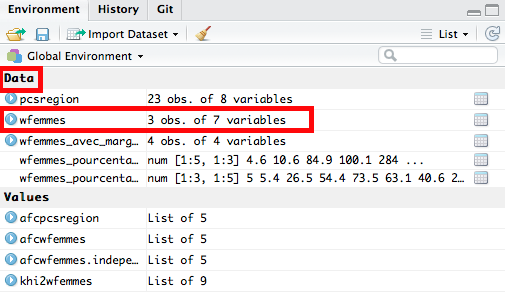

```{r setup, include=FALSE}
knitr::opts_chunk$set(echo = TRUE)
```


### Auteurs
**Jean-Baptiste PRESSAC** ([CRBC](https://www.univ-brest.fr/crbc/menu/Membres+du+laboratoire/Personnel_administratif_et_technique/Jean-Baptiste_Pressac "Laboratoire CRBC"), Université de Bretagne Occidentale) (Jean-Baptiste.Pressac@univ-brest.fr)     
**Laurent MELL** ([LABERS](https://www.univ-brest.fr/labers/ "Laboratoire LABERS"), Université de Bretagne Occidentale) (laurent.mell@univ-brest.fr)     


### Introduction

Ce premier travail s'inscrit dans une démarche de réflexion, plus large, que nous souhaitons entreprendre autour **l'analyse de données multidimensionnelles**. La spécificité de ce premier travail réside dans le fait que nous allons nous concentrer sur **l'analyse factorielle des correspondances (AFC)**. Notre objectif sera d'étudier les **éventuelles** liaisons entre les modalités de deux variables qualitatives. Par ailleurs, nous avons fait le choix d'utiliser le logiciel [R](https://www.r-project.org/ "Logiciel R") ainsi que l'environnement de développement [RStudio](https://www.rstudio.com/ "Environnement de développement RStudio").


#### Les données

Les données sur lesquelles nous allons travailler proviennent du MOOC [Analyse des données multidimensionnelles](https://www.fun-mooc.fr/courses/agrocampusouest/40001S03/session03/about "MOOC Analyse de données multidimensionnelles") sur la plateforme [FUN](https://www.fun-mooc.fr/ "Plateforme FUN"). Ce MOOC est proposé par [François Husson](http://math.agrocampus-ouest.fr/infoglueDeliverLive/membres/Francois.Husson "François Husson"), [Jérôme Pagès](http://math.agrocampus-ouest.fr/infoglueDeliverLive/membres/Jerome.Pages "Jérôme Pagès") et [Magalie Houée-Bigot](http://math.agrocampus-ouest.fr/infoglueDeliverLive/membres/Magalie.Hou%C3%A9e-Bigot "Magalie Houée-Bigot").

Les données sont issues d'un questionnaire du [CREDOC](http://www.credoc.fr/) publié en 1974 par Nicole Tabard. Le MOOC ne nous donne pas d'informations sur les circonstances dans lesquelles le questionnaire a été établi ni sur le nombre total de questions. Nous savons uniquement qu'il a porté sur 1724 femmes. L'AFC ne nous permet pas d'analyser l'intégralité du questionnaire mais il va nous servir pour étudier l'articulation des réponses qualitatives à deux questions :  Quelle est la famille idéale pour vous ? et Quelle activité convient le mieux à une mère de famille quand ses enfants vont à l’école ?

Le point de départ de l'analyse est le tableau de contingence reproduit ci-dessous. C'est ce type de données (les marges des totaux mis à part) que nous fournirons à la fonction de calcul de l'AFC.


Comme le souligne François Husson dans le MOOC, il est difficile de savoir à partir de ce tableau si les femmes sont favorables ou non au travail féminin. En effet, une majorité de femmes (908 sur 1724, soit 52%) ont répondu que la famille idéale est celle où "seul le mari travaille". Elles sont néanmoins 1123 sur 1724 (65%) à avoir répondu que l'activité convenant le mieux à une mère de famille quand ses enfants vont à l’école est de travailler à mi-temps. L'AFC va nous permettre d'étudier le lien entre ces deux questions et de lever cette apparente contradiction. Elle va notamment nous permettre de visualiser la nature de la liaison entre les deux questions. Mais qu'est ce qu'une liaison ?

Une liaison entre deux variables est l'écart entre les données observées et le modèle d'indépendance. Mettons pour l'instant de côté cette notion, nous reviendrons plus tard.

Commençons par ouvrir le logiciel RStudio et par créer un nouveau projet depuis le menu File > New Project. Choisissons ensuite "New directory" > "Empty project" puis saisissons *AFC-sous-R* dans Directory name. Téléchargeons le fichier [AnaDo_JeuDonnees_TravailFemme.csv](https://raw.githubusercontent.com/JBPressac/AFC-sous-R/master/AnaDo_JeuDonnees_TravailFemme.csv) du tableau de contingence et plaçons-le dans le répertoire "AFC-sous-R". Créons ensuite notre script R depuis File > New file > R script.

#### Définir la localisation du répertoire de travail

Afficher la localisation du répertoire de travail sous la forme d'un chemin absolu

```{r}
getwd()
```

La définition du répertoire de travail peut aussi être faite par le biais de la commande `Set As Working Directory` via l'onglet `More`. Cet onglet correspond au symbole de la roue crantée dans la fenêtre en bas à droite de RStudio.


#### Importation du jeu de données

On lit ensuite le fichier CSV.

```{r}
don <- read.table("AnaDo_JeuDonnees_TravailFemme.csv", header=TRUE, row.names=1, sep=";", check.names=FALSE, fileEncoding="latin1")
```

* La fonction `read.table()` permet de lire un fichier dans un format tabulaire et de créer une dataframe à partir de ce dernier.         
* L'argument `header=TRUE`permet de spécifier que la première ligne du jeu de données correspond aux intitulés des colonnes.       
* L'argument`row.names=1`permet de spécifier que le nom des lignes est contenu dans la première colonne.       
* L'argument `sep=";"`indique que le séparateur de colonne est le point-virgule.       
* L'argument `check.names=FALSE` permet d'empêcher R de modifier al syntaxe du nom des modalités de variable.
* L'argument `fileEncoding="latin1"` permet de spécifier l'encodage du fichier.     

Afin de faciliter, par la suite, la lecture et l'emploi du jeu de données, nous **stockons le résultat dans la variable** `don`.

Nous pouvons, très facilement et à n'importe quel moment, afficher le tableau de contingence `don` à partir du volet Data dans la fenêtre en haut à droite de RStudio.



Seules les trois premières colonnes du jeu de données sont utilisées ici. Nous avons donc besoin de suppprimer les colonnes dont nous n'aurons pas l'utilité. Plus spécifiquement, nous n'allons **sélectionner que les trois premières colonnes** avec la commande suivante.

```{r}
don <- don[,1:3]
```     

Nous pouvons voir que, dans le volet Data dans la fenêtre en haut à droite de RStudio, le nombre de variables affichées a été réduit.


Afin d'amliorer la lecture du tableau et, par la suite, du graphique, nous allons renommer les modalités des deux variables grâce à la fonction `dimnames()`

```{r}
(dimnames(don)[[1]][1]<-"Les 2 conjoints travaillent")
(dimnames(don)[[1]][2]<-"Travail du mari plus absorbant")
(dimnames(don)[[1]][3]<-"Seul le mari travaille")
(dimnames(don)[[2]][1]<-"Rester au foyer")
(dimnames(don)[[2]][2]<-"Travail à mi-temps")
(dimnames(don)[[2]][3]<-"Travail à temps plein")
```

Pour la fonction `dimnames()` :       

* `[[1]]` (entre deux doubles crochets) permet de spécifier que nous allons renommer une ou plusieurs modalités en ligne.
* `[[2]]` (entre deux doubles crochets) permet de spécifier que nous allons renommer une ou plusieurs modalités en colonne.
* `[1]` (entre crochets) permet de spécifier que nous allons renommer la première modalité d'une variable.
* `[2]` (enter crochets) permet de spécifier que nous allons renommer la deuxième modalité d'une variable.       

Suivant cette logique, lorsque nous écrivons, par exemple, `(dimnames(don)[[2]][3]<-"...")`, cela signifie que nous allons renommer la troisième modalité en colonne.

Rappellons que notre objectif est bien de **visualiser la nature de la liaison entre deux variables qualitatives**. Mais faut-il encore que cette liaison soit **significative**.        

Pour ce faire, nous réalisons un **test du Khi2**.      


#### Test du Khi2

Le test du khi2 mesure la **significativité d'une relation mais pas son intensité**. Afin de réaliser ce test du khi2, nous utilisons une fonction fournie de base avec le logiciel R. Il s'agit de la fonction `chisq.test`. Il n'est pas nécessaire d'installer une librairie supplémentaire afin de réaliser ce test.       

```{r}
chisq.test(don)
```

Le terme `X-squared` est à lire `Khi2` soit Khi au carré. La fonction `chisq.test` nous donne, entre autres, la valeur du Khi2 qui est un **indicateur de la significativité de la liaison**. Mais ce qui nous interesse ici est la `p-value`. Nous voyons ici que la `p-value` est inférieure à 2,2x10^-16^. Cela signifie que la **probabilité que les variables soient indépendante** est inférieure à 2,2x10^-16^. Ce qui nous permet de rejeter l'hypothèse d'indépendance entre les deux variables. Pour autant, cela ne veut dire que les variables soient dépendantes. Les réponses à la question sur la famille idéale sont probablement liées aux réponses concerant l'activité convenant le mieux à une mère de famille dont les enfants vont à l'école.          


#### Test du Khi2 - Explications

Le test du khi2 permet de **déterminer la probabilité que les deux variables d'un tableau de contingence sont indépendantes**, c'est-à-dire qu'il n'existe pas de relation entre les modalités en ligne et les modalités en colonne (les unes ne conditionnent pas les autres, et réciproquement). Dit autrement et comme le [rappelle très clairement Julien Barnier](https://alea.fr.eu.org/pages/khi2 "Test du khi2 par Julien Barnier"), cela veut dire que le "fait d'appartenir à une modalité de la première variable n'a pas d'influence sur la modalité d'appartenance de la deuxième variable". Dans ce test, l'hypothèse nulle (H0) suppose qu'il y a indépendance entre les deux variables. Si nous acceptons l'hypothèse d'indépendance (H0), nous n'aurons pas d'utilité à réaliser une AFC car les points projetés seront extrêmement proches ou confondus avec le centre de gravité, confondus avec le centre du graphe. Si nous rejetons l'hypothèse d'indépendance (p-value < 0,05), l'hypothèse alternative (H1) suppose que la liaison entre les deux variables est significative sans que nous puissions définir l'intensité de la liaison.

Du fait que nous ayons obtenu une p-value inférieure à 2.2e-16 et, par extension, inférieure au seuil de 0,05, nous **rejetons l'hypothèse d'indépendance entre les deux variables**.

Comme le résultat est significatif, nous stockons le résultat de la fonction dans la variable `khi2don`.

```{r}
chisq.test(don) -> khi2don
```     


#### Test du Khi2 - Aides à l'interprétation

Le test du khi2 est symétrique. Les lignes et les colonnes du tableau croisé sont interchangeables. Le résultat du test sera exactement le même. Il n'y a pas de "sens de lecture" du tableau.

Nous pouvons afficher le tableau de contingence d'origine (**tableau des données observées**) en sélectionnant la valeur `observed`.

```{r}
khi2don$observed
```

De la même manière, nous pouvons afficher tableau d'indépendance (**tableau des effectifs théoriques**) en sélectionnant la valeur `expected`. Dans ce contexte, nous calculons le tableau des pourcentages théoriques, en multipliant pour chaque case la proportion observée dans la population des deux modalités correspondantes. Puis, le tableau des effectifs théoriques se calcule en multipliant le tableau des pourcentages théoriques par l'effectif total.

Pour plus de détails, nous vous recommandons la lecture de ce document de Julien Barnier : [Tout ce que vous n'avez jamais voulu savoir sur le Khi2 sans jamais avoir eu envie de le demander](https://alea.fr.eu.org/pages/khi2 "Test du khi2 par Julien Barnier").

```{r}
khi2don$expected
```

Nous pouvons afficher le tableau des résidus (**tableau des écarts à l'indépendance**) en sélectionnant la valeur `residuals`. Un résidu positif signifie que les effectifs dans la case sont supérieur à ceux attendus sous l'hypothèse d'indépendance. Et l'inverse pour un résidu négatif.

```{r}
khi2don$residuals
```     


##### Rappel de l'objectif

Notre objectif est bien de **visualiser la nature de la liaison entre les deux variables qualitatives**.

Sachant qu'une liaison est l'écart entre les données observées et le modèle d'indépendance, qu'est-ce que le modèle d'indépendance ?

...     


#### Indépendance et écart à l'indépendance (Rappel)

...     


#### Important

Rappelons (au cas où ce n'était déjà pas assez clair) que la liaison correspond à **l'écart entre les données observées et le modèle d'indépendance**.

Il y a **trois façons de caractériser la liaison** entre les deux variables qualitatives.

* La **significativité** de la liaison (qui se mesure avec le test du khi2).
* L'**intensité** de la liaison (qui se mesure, entre autre, avec le Phi2).
* La **nature** de la liaison (qui correspond à l'association entre les modalités et qui est représentée par le biais de l'AFC).

Exemple des lunettes et des yeux bleux pour illustrer la différence entre intensité et significativité de la liaison.

L'AFC travaille, non pas sur le tableau de contingence, mais sur le tableau de probabilité.     


#### Chargement des packages

Le test du Khi2 a permis d'écarter l'hypothèse d'indépendance. Il y a donc une liaison entre les modalités des deux variables. De fait, nous pouvons faire une AFC pour visualiser la nature de la liaison. Pour notre part, nous avons choisi d'utiliser le **package** [**FactoMineR**](https://cran.r-project.org/web/packages/FactoMineR/index.html "Page du package FactoMineR") (Dédié à l'analyse multidimensionnelle de données) mais il y en existe d'autres qui peuvent être utilisés pour réaliser ce type de méthode statistique.

Nous chargeons la librairie `FactoMineR` qui permet de réaliser plusieurs analyses de données multi-dimentionnelles (AFC, ACP, ACM, etc.).

```{r}
library (FactoMineR)
```     


#### AFC - Résultats

les sorties et le graphe par défaut.       
Amélioration de la représentation graphique.       

```{r}
res <- CA(don)
```

On stocke le résultat de l'AFC dans la variable "res"
Slide n°5 du PDF de Husson. Rappel de l'apparente contradiction des réponses. 
Le tableau de contingence ne permet pas de savoir si les femmes des années 70 
sont favorables ou non à l'activité féminine.
Par contre, Une première lecture du graphe de l'AFC permet de dire que les modalités des réponses 
s'associent entre elles des plus favorables au travail féminin aux plus défavorables au travail féminin.


explor (Interface de production et d’exploration interactive des résultats d’analyse multidimensionnelle)
library (explor)

Représentation graphique avec le package explor
explor(res)


Si on fait l'AFC avec les données du modèle d'indépendance :

```{r}
res.independance <- CA(khi2don$expected)
```

Demander au public d'interpréter cette AFC.       
Simplement, lorsqu'il y a indépendance entre les 2 variables, tous les points sont confondus avec l'origine.       

```{r}
summary(res.independance)
```

Amélioration de l'affichage du graphe...       

```{r}
plot(res, cex = 0.6, title = "Représentation graphique", selectRow = "cos2 0.7", selectCol = "cos2 0.7")
```     

Détails des arguments utilisés dans la fonction `plot()`.       

* L'argument `cex=` permet de madifier la taille de la police.       
* L'argument `title=` permet de donner un titre au graphique.       
* L'argument `selectRow=` permet de sélectionner les modalités en ligne à afficher en fonction de critères particuliers.       
* L'argument `selectCol=` permet de sélectionner les modalités en colonne à afficher en fonction de critères particulier.       


##### Les résultats

```{r}
summary(res, nbelements = Inf)
```

Les tableaux avec les résultats n'affichent, par défaut, que les 10 réponses les plus significatives.       

* L'argument `nbelements=Inf` permet de retirer cette limite.       

Cette commande permet d'obtenir :       

* Le résultat du test du khi2 avec la p-value.       
* Un tableau avec les variance de chaque dimension (axe) et les pourcentages de variance.      

Ce qu'il appelle la variance est aussi appelée dans la littérature "valeur propre" ou "inertie". La variance mesure l'intensité de la liaison entre les deux variables expliquées par cet axe. La variance est comprise entre 0 et 1. Le total des variances (le Phi2) est la mesure de l'intensité de la liaison (liaison = l'écart à l'indépendance).       

`Le Phi2 = 0.117 + 0.019 = 0.136`

A quoi comparer cette valeur ?        

Les variances étant au max égales à 1, le Phi2 peut avoir au maximum une valeur de 2. 0.136 << 2 : L'intensité de la liaison est faible. Les réponses s'associent globalement peu entre elles. Mais rare sont les cas où l'intensité de la liaison entre les variables est forte.       

Le % of var, soit le pourcentage de variance, représente le % de variance expliqué par l'axe. Autrement dit, la dimension 1 (ou l'axe 1) explique 86.292% de la variance entre les deux variables. Et le plan constitué des axes 1 et 2 explique 100% de la variance. Ce qui est normal puisque les pourcentages se répartissent sur tous les axes. S'il y avait eu 8 axes, le pourcentage d'inertie se serait réparti sur les 8 axes.       

Dans quel cas peut-on avoir 8 axes ?

Ce qu'il faut savoir c'est que le nombre d'axes est égal au nombre minimum entre le nombre de colonnes - 1 et le nombre de lignes - 1 du tableau de contingence. Autrement, si vous avez un tableau de contingence avec en ligne 9 modalités et en colonnes 15 modalités. On fait 9 - 1 = 8 puis 15 - 1 = 14 et on garde 8.       

Dans ce cas le % de variance permettra de choisir le nombre d'axes à retenir pour l'analyse.       

La position par rapport au centre de l'axe. Le centre de l'axe correspond au profil moyen en ligne et le profil moyen en colonne.       

Expliquer le profil moyen avec le fichier Excel et montrer que les pourcentages colonnes de "travailler à mi-temps" sont proches du profil colonne moyen. Ce que l'on retrouve bien sur le graphe où "travailler à mi-temps" est proche du centre du graphe.       

Peut-on interpréter la position entre deux point lignes ou deux points colonnes ?       

Rappel : L'AFC ne travaille pas sur le tableau de contingence mais transforme le tableau de contingence en tableau de probabilité. C'est à dire le tableau de contingence dont les valeurs sont divisées par la population. (voir fichier Excel). Deux point lignes sont donc proches l'un de l'autre si leur profil en porcentage est similaire.       

Par contre, on peut dire que les lignes sont "du côté" des colonnes auxquelles elles s'associent le plus. Dans la mesure où ces colonnes sont éloignées du centre de gravité. Et respectivement, les colonnes sont "du côté" des lignes avec lesquelles elles s'associent le plus. Dans la mesure où ces lignes sont éloignées du centre de gravité. On en veut pour preuve que sur le graphe "seul le mari travaille" est du côté de "rester au foyer". Si on revient sur le tableau de contingence (slide 5 de Husson) ce résultat peut sembler contradictoire  puisque 573 personnes ont répondu à "seul le mari travaille" et "travailler à mi-temps" alors que  seulement 241 personnes ont répondu à "seul le mari travaille" et "rester au foyer". Ne devrait-on pas dire que "seul le mari travaille" s'associe le plus à "travailler à mi-temps". Cependant quand on regarde les marges du tableau de contingence... et quand on regarder les pourcentages en colonne dans le fichier Excel...

